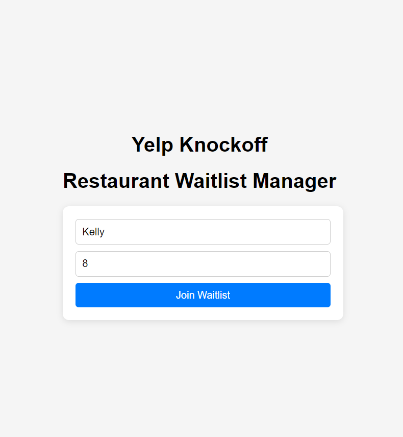

# Restaurant Waitlist Management App

Welcome to the Restaurant Waitlist Management App! This application is designed to help restaurant customers conveniently join a waitlist, receive real-time notifications when their table is ready, and track their position in the queue. The app provides a simple and user-friendly experience for managing the wait for a table at participating restaurants.

Open your browser and go to https://waitlist-manager-client-618b1c8585d4.herokuapp.com to start using the app.

## Features
- **Join the Waitlist**: Customers can quickly add themselves to the restaurant's waitlist with basic information such as name, party size, and contact details.
- **Real-Time Notifications**: Receive notifications when your table is ready, helping you make the most of your waiting time.
- **Track Your Position**: Keep track of your position in the waitlist so you know how much longer you'll have to wait.

### Current Liminations and Future Improvements

- **State Management**: The app currently uses basic state management with React's built-in `useState` and `useEffect` hooks. As complexity grows, state management systems like Redux can be utilized.
- **UI/UX Enhancements**: There are areas of improvments for the app's accessibility, adding support for features such as keyboard navigation, improved screen reader compatibility, and a more polished, reactive design to enhance the user experience.
- **i18n (Internationalization)**: Support multiple languages in future to ensure the app can be easily used by customers in different regions. This will include adding language options and translating UI elements.
- **Component Separation**: To make the codebase more maintainable, refactor the monolithic component into smaller, more focused units, separating UI presentation from business logic where appropriate.
- **Check-in Timeout**: Introduce a feature where tables will automatically expire if customers do not check in within a specified time after being notified, ensuring that tables do not remain unused for too long.